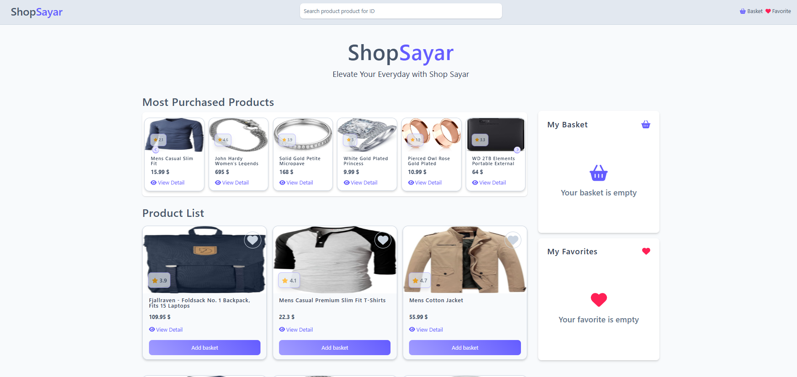
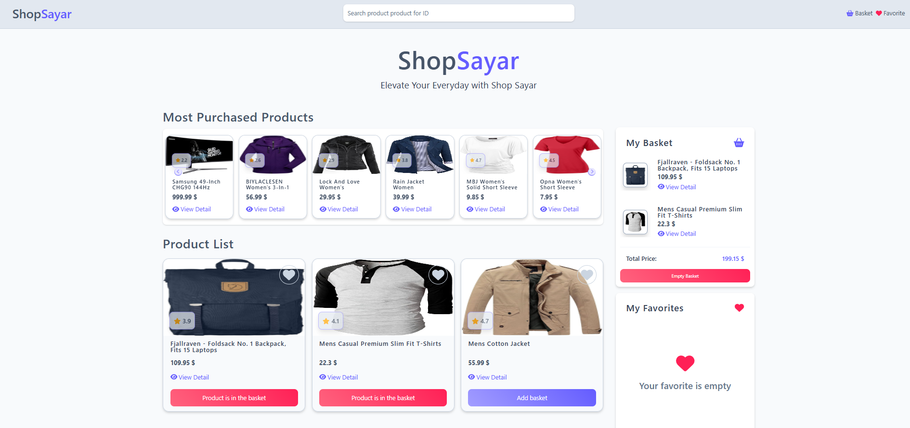
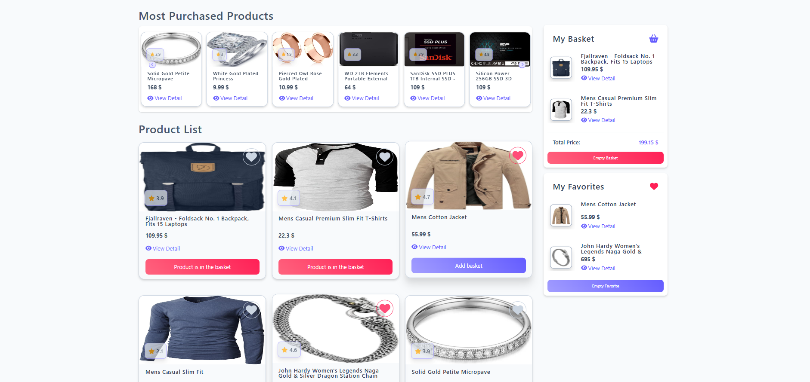
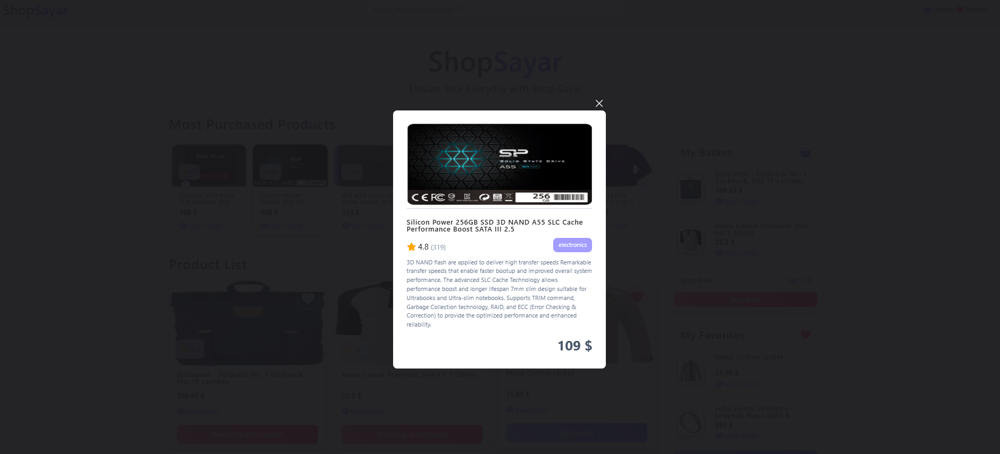
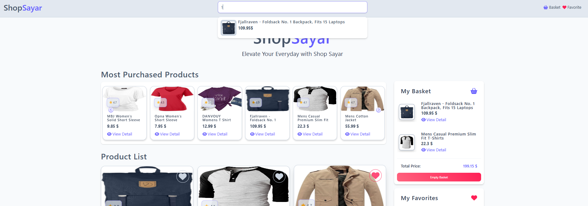

# Shop Sayar - E-Ticaret Uygulamam

## Demo : [Uygulama Demosu](https://shop-sayar.netlify.app/)

Bu uygulamayı geliştirirken, `https://fakestoreapi.com/products` adresinden ürünleri çekerek kullanıcıya dinamik ve modern bir alışveriş deneyimi sunmayı hedefledim. Tüm işlevselliği **tek bir `script.js` dosyası** içinde, **IIFE (Immediately Invoked Function Expression)** yapısı kullanarak kodladım.

---

## Öne Çıkan Özellikler

### Ürün Listeleme

- API'den çektiğim ürünleri dinamik olarak kart yapısında gösterdim.
- Her ürün kartında:

  - **Sepete Ekle**
  - **Favorilere Ekle**
  - **Detayları Gör**

    gibi temel özellikleri ekledim.

### Kart Klonlama

- `.clone()` yöntemiyle oluşturduğum kartları farklı alanlarda (örneğin slider, sepet, favoriler) tekrar kullandım.
- Dinamik öğelerle sorunsuz çalışması için **event delegation** yapısını tercih ettim.

### LocalStorage Entegrasyonu

- Kullanıcının sepete ve favorilere eklediği ürünleri `localStorage` ile sakladım.
- Böylece sayfa yenilense bile veriler korunuyor.

### Sepet ve Favoriler

- Kullanıcılar ürünleri sepete veya favorilere kolayca ekleyip çıkarabiliyor.
- Ayrıca isterlerse tümünü tek tıklamayla **`Temizle`** butonuyla sıfırlayabiliyorlar.
- Tüm bu işlemlerde kullanıcıya bilgi vermek için **Toastify** bildirimlerini kullandım.

### Ürün Detayları & Arama

- “Detayları Gör” butonuna tıklanınca, ürünün detay bilgilerini `id` üzerinden çektim.
- Bu detayları **Fancybox** ile şık bir modal içinde gösteriyorum.
- Arama alanında ise **debounce** kullanarak performansı artırdım.

### Slider Özelliği (Slick Slider)

- Kartları `.clone()` ile slider alanına ekledim.
- Bu ürünleri **Slick Slider** ile döngüsel ve otomatik bir şekilde gösterecek şekilde yapılandırdım.

### Temizleme Fonksiyonu

- Sepet ve favori alanlarını **`.empty()`** ile hızlıca temizlenebilir hale getirdim.

### Özel jQuery Plugin

- Sepete ürün ekleme işlemi için küçük ama etkili bir **jQuery plugin** yazdım.
- Bu sayede kodun tekrar kullanılabilirliğini artırmış oldum.

### Animasyonlar

- Ürün kartları üzerine gelindiğinde `mouseenter` ile animasyonlar ekledim.
- `addClass`, `removeClass`, `fadeIn`, `fadeOut` gibi efektlerle kullanıcı etkileşimini daha canlı hale getirdim.

---

## Kullandığım Kütüphaneler ve Araçlar

| Kütüphane / Plugin                | Ne İşe Yarıyor?                            |
| --------------------------------- | ------------------------------------------ |
| **jQuery**                        | Temel DOM işlemleri, event yönetimi        |
| **Slick Slider**                  | Ürünleri kaydırmalı şekilde göstermek için |
| **Fancybox**                      | Ürün detaylarını modal olarak sunmak için  |
| **Toastify**                      | Kullanıcıya anlık bildirim vermek için     |
| **Debounce (Lodash veya Custom)** | Arama performansını artırmak amacıyla      |

---

## Proje Yapısı

- Tüm JavaScript kodlarını **tek bir `script.js`** dosyasına yazdım.
- Kod yapısını daha düzenli tutmak ve global scope’u kirletmemek için **IIFE (Immediately Invoked Function Expression)** kullandım.

---

## Uygulama Resimleri

| Ana Sayfa                     | Sepet Listesi                      |
| ----------------------------- | ---------------------------------- |
|  |  |

| Favorite Listesi                    | Detay Modal                         |
| ----------------------------------- | ----------------------------------- |
|  |  |

| Arama Sonucu                        |
| ----------------------------------- |
|  |
